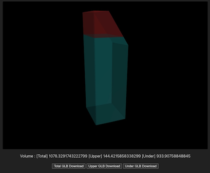

# 令和4年度 民間ユースケース開発　UC22-003「容積率可視化シミュレータ」の成果物（Volume Shape Generator）




## ユースケースの概要

近年、マンションの老朽化の急増が問題視される中、維持管理の適正化とともに、建替えの円滑化によるマンション再生の重要性が高まっています。 また、マンション建替円滑化法の施行により老朽化したマンションの建替えルールが整備されているものの、マンション所有者同士の合意形成及び建替えまでの実行プロセスの難易度がハードルとして存在しています。

今回の実証実験では、3D都市モデルの建築物モデルや都市計画モデルを解析し、建物の未消化容積率を直感的でわかりやすく可視化するアプリケーションを開発することにより、マンション所有者及び民間事業者による開発余地の把握を可能とし、建替え・有効活用等の活性化への寄与を目指しています。

## 開発システムの概要
今回の実証実験では、3D 都市モデルの建築物モデル及び道路モデルを活用して、都市計画及び建築基準法に基づく指定容積率によって建築可能な建物の最大ボリューム（以下、容積ボリューム）と既存建築物の差分（余剰容積）を三次元的に分析して可視化するシステムを開発しました。

GitHubリポジトリにて、以下の処理を行うアプリケーションをOSSとして公開しています。

- 建築物情報をJSON形式で受け取り、建築可能な建物の最大ボリュームと既存建築物の差分を3Dモデルを生成します。
- 建築物の3Dモデルデータの生成や、隣地斜線制限などの条件に従いモデルの加工を行う必要があるため、ブラウザ上で動くリアルタイム3Dエンジンの```Babylon.js```を使用しています。
- 生成した3Dモデルから、容積値の算出とGLB形式の書き出しを行います。
- 本アプリケーションでは機能確認用のサンプルを用意しています。SampleのJSON情報から3Dモデルを生成し、容積の数値表示とGLBファイルのダウンロードをテストできます。

Volume Shape Generatorは以下の機能を有したアプリケーションです。

- ボリューム生成処理を行い、生成したボリュームから容積値とGLBファイルを取得する機能
- 上記ボリューム生成、データ取得を呼び出すAPI機能
- API機能を使ってサンプルの建築物データからボリューム生成処理を行い、
生成したボリュームの容積値の表示とGLBファイルのダウンロードを行う画面を表示する機能確認用サンプル

各機能のソースコードは以下のディレクトリに格納されています。
- ボリューム生成機能、API機能のソースコードは```src/service```ディレクトリに格納されています。
- 確認用サンプルのソースコードは```src/sample```ディレクトリに格納されています。
  - src下の```index.html```、```main.ts```、```style.css```ファイルはアプリケーションを実行した際にサンプルが実行されるように記述しています。

## ライセンス
- 本マニュアルの著作権は国土交通省に帰属します。
- 本マニュアルはProject [PLATEAUのサイトポリシー](https://www.mlit.go.jp/plateau/site-policy/)（CCBY4.0および政府標準利用規約2.0）に従い提供されています。

## 注意事項
- 本マニュアルは参考資料として提供しているものです。動作保証は行っておりません。
- 予告なく変更・削除する可能性があります。
- 本マニュアルの利用により生じた損失及び損害等について、国土交通省はいかなる責任も負わないものとします。

## 参考資料　
- [容積率可視化シミュレータ技術検証レポート](https://www.mlit.go.jp/plateau/libraries/technical-reports/)
- [PLATEAU Webサイト Use caseページ「容積率可視化シミュレータ」](https://www.mlit.go.jp/plateau/use-case/uc22-003/)
- [Babylon.js Webサイト](https://www.babylonjs.com/)