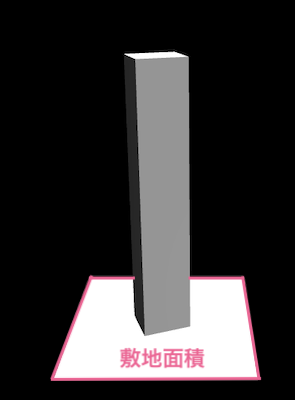
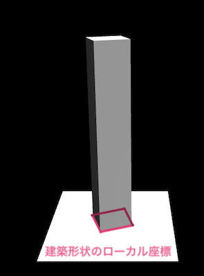
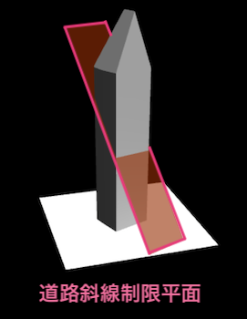
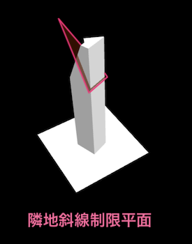
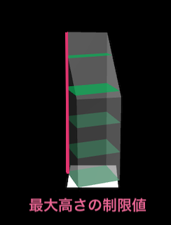

# 生成条件を指定したボリューム生成

必要な建物情報をJSON形式にし、APIの```getVolumeShapesData```関数に渡すことで生成条件を指定したボリューム生成を行うことができます。

## 3Dモデルデータ生成に必要な情報

3Dオブジェクトを生成するには既存建築物の以下の情報が必要になります。

- 敷地面積、階高、容積率
    - 建物形状の高さの上限の算出に使用します。
- 建物形状のローカル座標
    - 建物のフットプリント座標から建物形状のモデルデータを生成します。このモデルデータから、各種制限によるブーリアン処理を行います。
- 隣地斜線制限平面ローカル座標、道路斜線制限平面ローカル座標
    - 制限面座標から建物形状のカッティング処理に必要なモデルを生成しブーリアン処理を行います。
- 地域の高さ制限
    - 敷地面積、階高、容積率から算出する高さ上限より優先される高さ制限値です。
- 算定対象の建物の高さ
    - 建築可能な建物の最大ボリュームと既存建築物の差分を表すために使用します。


建築物情報のJSONデータの用意について記します。<br>
下記のコードは「サンプルデータを使ったボリューム生成」ページで使用しているJSONテキストデータをJSONファイル形式で表したものです。
生成条件を指定したボリューム生成を行う場合はこのようなJSONファイルをご用意下さい。

```json5
[
  {
    //敷地面積
    "siteArea": 64.54208,
    //建物形状ローカル座標
    "building": [
      {
        "x": 4.874860211275518,
        "y": -1.7919120267033577,
        "z": 0
      },
      {
        "x": 4.8747810469940305,
        "y": -1.786204481497407,
        "z": 0
      },
      {
        "x": 2.555339680518955,
        "y": 4.519403563346714,
        "z": 0
      },
      {
        "x": -4.866903026588261,
        "y": 1.789831669535488,
        "z": 0
      },
      {
        "x": -4.86551877995953,
        "y": 1.7845792341977358,
        "z": 0
      },
      {
        "x": -4.927262370940298,
        "y": 1.647432820405811,
        "z": 0
      },
      {
        "x": -3.9609530312009156,
        "y": -0.9793286826461554,
        "z": 0
      },
      {
        "x": -2.54695413261652,
        "y": -4.522207274567336,
        "z": 0
      },
      {
        "x": 4.874860211275518,
        "y": -1.7919120267033577,
        "z": 0
      }
    ],
    //道路外側斜線制限面ローカル座標
    "syasenPlanes": [
      [
        {
          "x": 9.324718687217683,
          "y": -11.179982529953122,
          "z": -0.000014738179743289948
        },
        {
          "x": -0.056850585620850325,
          "y": 11.992897959891707,
          "z": 37.50003549922258
        },
        {
          "x": -8.300155875273049,
          "y": 8.65557556413114,
          "z": 37.50003540609032
        },
        {
          "x": 1.0814618384465575,
          "y": -14.517285314388573,
          "z": -0.000014831312000751495
        }
      ]
    ],
    //隣地斜線制限面ローカル座標
    "rinchPlanes": [
      [
        {
          "x": -2.2614220874384046,
          "y": -5.963912645820528,
          "z": 30.999998805113137
        },
        {
          "x": 5.774045082274824,
          "y": -2.9426687844097614,
          "z": 52.46172823663801
        },
        {
          "x": -5.229699608404189,
          "y": 1.9306384297087789,
          "z": 30.99999972153455
        }
      ],
      [
        {
          "x": -5.229699608869851,
          "y": 1.9306384334340692,
          "z": 30.999999720603228
        },
        {
          "x": 0.11599631328135729,
          "y": -0.4368482059799135,
          "z": 41.426257128827274
        },
        {
          "x": 2.533916859421879,
          "y": 5.00749797327444,
          "z": 30.999999740161
        }
      ],
      [
        {
          "x": 2.533916859421879,
          "y": 5.00749797327444,
          "z": 30.999999740161
        },
        {
          "x": -2.224506298545748,
          "y": -5.706875113770366,
          "z": 51.51868245750666
        },
        {
          "x": 5.463830733206123,
          "y": -2.834273154847324,
          "z": 30.999999093823135
        }
      ]
    ],
    //算定対象の建物の高さ
    "citygml_me": 17.554,
    //容積率
    "far": 479.7,
    //階高
    "kaidaka": 5.5,
    //生成する建物の高さをこの値で制限。容積率より優先
    "maxLimitH": null
  }
]
```

各パラメーターに関して説明します。

- siteArea<br>
敷地面積を入力します。
入力する値の単位は平方メートルです。<br>
敷地面積は、容積率と掛け算して、最大の延べ床面積を算出し、階数（建物高さ）の最大値を算定するために使用します。



- building<br>
フットプリント(敷地に対する建築の占有領域)の中心を原点(x:0, y:0, z:0)とし、 フットプリントのポリゴンの各頂点座標を入力します。<br>
座標は平面座標系(Z方向が高さを表します)、単位はメートルで入力します。<br>
この座標配列から高さ方向に押し出しポリゴン生成方式で建物形状のモデルデータを生成します。




- syasenPlanes<br>
道路外側斜線制限平面のローカル座標を入力します。<br>
座標は平面座標系(Z方向が高さを表します)、単位はメートルで入力します。<br>
斜線制限とは道路境界線または隣地境界線からの距離に応じて建築物の各部分の高さを制限することにより、
道路や隣地の採光、通風を確保し、圧迫感を和らげるものです。<br>
フットプリントの中心を原点(x:0, y:0, z:0)とし、
斜線制限の領域を空間内で平面として表す斜線制限平面のポリゴンの各頂点座標を入力します。

```json
  [
    {
      "x": 9.324718687217683,
      "y": -11.179982529953122,
      "z": -0.000014738179743289948
    },
    {
      "x": -0.056850585620850325,
      "y": 11.992897959891707,
      "z": 37.50003549922258
    },
    {
      "x": -8.300155875273049,
      "y": 8.65557556413114,
      "z": 37.50003540609032
    },
    {
      "x": 1.0814618384465575,
      "y": -14.517285314388573,
      "z": -0.000014831312000751495
    }
  ]
```

斜線制限が複数ある場合は全て入力します。<br>
この座標配列から高さ方向に押し出しポリゴン生成方式でカット範囲のモデルデータを作成し、建物形状のモデルデータをカットします。
<br>


下図は道路斜線制限平面のイメージです。<br>




- rinchPlanes<br>
隣地斜線制限平面のローカル座標を入力します。<br>
座標は平面座標系(Z方向が高さを表します)、単位はメートルで入力します。<br>
道路外側斜線制限平面の場合と同様にフットプリントの中心を原点(x:0, y:0, z:0)とし、
斜線制限の領域を空間内で平面として表す斜線制限平面のポリゴンの各頂点座標を入力します。





- citygml_me<br>
算定対象の建物の高さを入力します。
入力する値の単位はメートルです。<br>
これは余剰容積ボリュームを算定する対象の建物の高さのことで、地盤面から既存のルーフまでの高さを指します。


- far<br>
容積率を入力します。<br>
入力する値の単位はパーセントです。
容積率とは敷地面積に対する建物の延べ床面積の割合です。<br>


- kaidaka<br>
階高を入力します。
入力する値の単位はメートルです。<br>
階高は建物の各階の高さで、フロアに依らず一定の高さになります。


- maxLimitH<br>
生成する容積ボリュームの最大高さの制限値を指定します。
入力する値の単位はメートルです。
地区計画などで、地域ごとに建物高さの最大値が指定されている場合は、ここにその最大値を指定します。



建築物情報のJSONデータをAPIの関数に渡すと、本アプリケーションで定義されている```BuildingParam```という型エイリアスに格納されます。<br>

```typescript
type BuildingParam = {
  siteArea: number //敷地面積
  building: BABYLON.Vector3[] //建物形状ローカル座標
  syasenPlanes: BABYLON.Vector3[][] //道路外側斜線制限面ローカル座標
  rinchPlanes: BABYLON.Vector3[][] //隣地斜線制限面ローカル座標
  citygml_me: number //算定対象の建物の高さ
  far: number //容積率
  kaidaka: number //階高
  maxLimitH: number | null //生成する建物の高さをこの値で制限。容積率より優先
}
```


## ボリューム生成と確認

アプリケーションが用意している機能確認用サンプルの表示方法で、生成条件を指定したボリュームを確認する場合は下記手順を行って下さい。

- 確認用サンプルでは```src/sample```ディレクトリ内の```VolumeShapeGenerateController```クラスの```startOperation```関数内で```BuildingParamSample```クラスの```getParamsJsonText```関数を実行しJSONデータ取得処理を行っています。
- 生成条件を指定したボリューム生成を確認用サンプルの表示方法で確認したい場合は、
指定した生成条件に従ってJSONデータを作成し、
確認用サンプルのJSON取得処理部分を、作成したJSONデータを取得するように変更してボリューム生成を行います。
- 「サンプルデータを使ったボリューム生成」で紹介しました```$ npm run dev```コマンドで確認することができます。

指定した生成条件に従い生成したボリュームから容積値とGLBファイルを取得する機能だけが必要な場合は、
```src/service```ディレクトリ内のボリューム生成、データ取得機能とAPI機能のみ使用します。

- src下の```index.html```、```main.ts```、```style.css```はプロジェクトに合うように適宜変更して下さい。
- 「API仕様」ページを確認し、```src/service/api/VolumeShapeGenerator.ts```ファイルの関数に必要なデータを引数として渡し容積値とGLBファイルを取得して下さい。

## ソースコードのビルド

```$ npm run dev```コマンドによる開発用ローカルサーバーでの確認だけでなく、
アプリケーションを本番環境で実行する場合は```$ npm run build```コマンドでソースコードをビルドします。

コマンドラインを操作します。```volume-shape-generator```ディレクトリに移動し以下のコマンドを実行します。

```
$ npm run build
```
```volume-shape-generator```ディレクトリ下に```dist```フォルダが作られ本番用に最適化されたコードが書き出されます。


ビルドが成功したら下記コマンドを実行しプレビュー用のサーバー上で確認ができます。
```
$ npm run preview
```

```npm run preview```コマンドは、ソースコードをビルドしてプレビュー用の環境で実行するために使用されます。
通常、```npm run dev```コマンドよりも本番環境に近い環境でアプリケーションを確認することができます。

