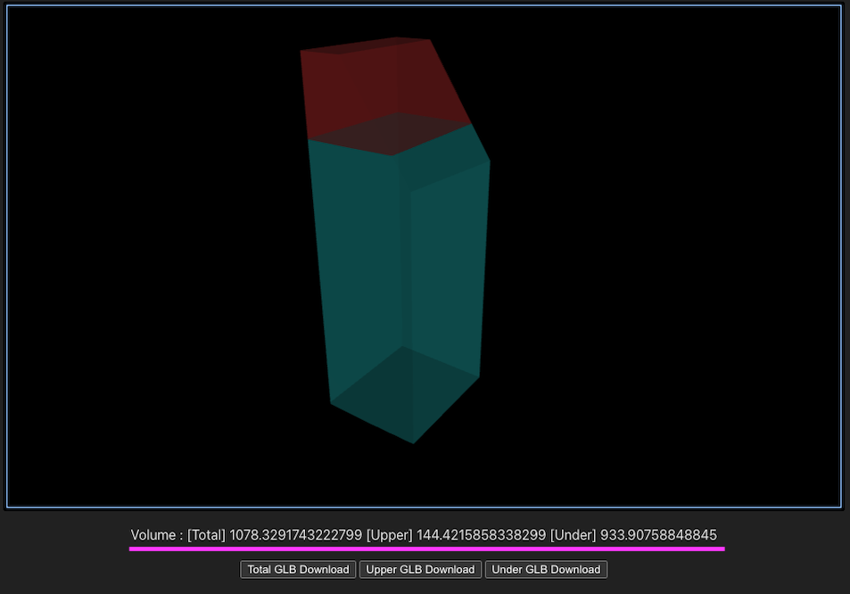
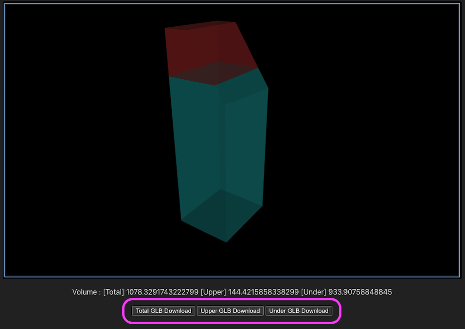

# サンプルデータを使ったボリューム生成

アプリケーションが用意している機能確認用サンプルを実行して、以下の機能を実装した画面を表示します。

- サンプルの建築物データから生成したボリュームのモデル表示機能
- 容積値の表示機能
- モデルデータをGLB形式でダウンロードするボタン機能

サンプルの建築物データには、本アプリケーションの```buildingParamSample.ts```ファイル内のJSONテキストデータが使用されます。

## 開発モードでアプリケーションを起動

Node.jsを使用するアプリケーションですので、サンプルはサーバー上で実行しブラウザで確認します。<br>
確認手法の一つである、開発用サーバーを起動して確認するコマンドを利用します。

- コマンドラインを開き、```volume-shape-generator```ディレクトリに移動します。
- 以下のコマンドを実行します。

```
$ npm run dev
```

- ローカルで開発用サーバーが起動します。表示されたURLをブラウザで開きます。
- アプリケーションが起動し、機能確認用サンプルが実行されます。

```
  ➜  Local:   http://localhost:5173/
  ➜  Network: use --host to expose
  ➜  press h to show help
```


## 機能確認用サンプルの処理の流れ

```src/main.ts```から```src/sample/VolumeShapeGenerateController.ts```の```startOperation```関数が実行されボリューム生成処理が始まります。
サンプル用のBabylon.jsのSceneとJSONテキストを引数としてAPIを実行し、容積値とGLBを受け取ります。
データの受け取りが成功すると、容積値の結果を表示します。



GLBのダウンロードボタンが表示されます。
ダウンロードボタンをクリックすると端末にGLBファイルがダウンロードされます。



